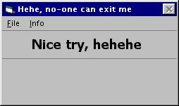



## NoExit

### Description

Simple example how to keep your program from closing by ALT+F4.

Some good notes for beginners including. Have a short look. Best Regards, Stefan
 
### More Info
 

             |
---                |---
**Submitted On**   |2000-11-13 01:07:36
**By**             |[Stefan Ebert](https://github.com/Planet-Source-Code/PSCIndex/blob/master/ByAuthor/stefan-ebert.md)
**Level**          |Beginner
**User Rating**    |5.0 (10 globes from 2 users)
**Compatibility**  |VB 6\.0
**Category**       |[Coding Standards](https://github.com/Planet-Source-Code/PSCIndex/blob/master/ByCategory/coding-standards__1-43.md)
**World**          |[Visual Basic](https://github.com/Planet-Source-Code/PSCIndex/blob/master/ByWorld/visual-basic.md)
**Archive File**   |[CODE\_UPLOAD1162311122000\.zip](https://github.com/Planet-Source-Code/stefan-ebert-noexit__1-12742/archive/master.zip)

